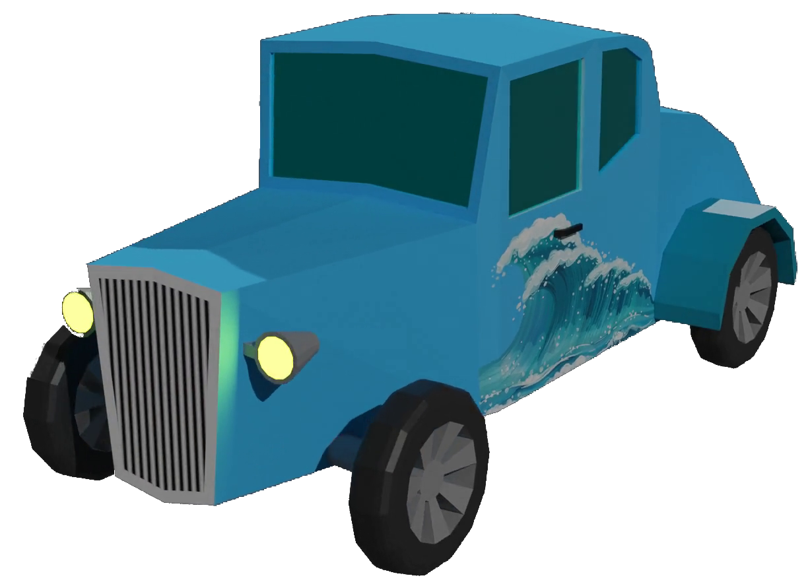

# Blazium Rijder (niet klaar)

Om dit project te openen, heb jij het programma Blazium 0.5.68 nodig of Godot Engine 4.4.1
1. Blazium: https://blazium.app/download/prebuilt-binaries
2. Godot Engine 4: https://godotengine.org/

Deze GitHubpagina wordt niet zo vaak bijgewerkt. Voor de laatste versie, ga naar https://www.markwiering.nl/Archief/blaziumrijder_project.7z of naar https://markwiering.itch.io/blazium-rijder 

Mocht jij dit project toch van GitHub willen halen, dan kan dat natuurlijk ook!

# Licentie #
Publiek domein. Unlicence. Nul beperkingen.

# Aanwezige elementen die niet van mij zijn #
1. De tekening van Bloom (Winx Club) op de achterklep van de cyaanblauw Hotrodauto. Deze gebruik ik met toestemming van Taralen: https://www.deviantart.com/taralen/art/DD-Bloom-646965506
2. De muziek in het spel (menu + spel zelf). Dit is van Adrian von Ziegler. Dit mag van hem gebruikt worden zolang zijn naam vermeld wordt: https://www.youtube.com/watch?v=ihZwWD4MFtA

Specifiek op die twee dingen geldt: vermeld hun naam erbij! Doe het uit respect voor hun harde werk!

Voor al het overige geldt de **Unlicence**, want op mijn eigen werk rust geen auteursrecht. Alles wat ik maak is publiek domein. :-) 
